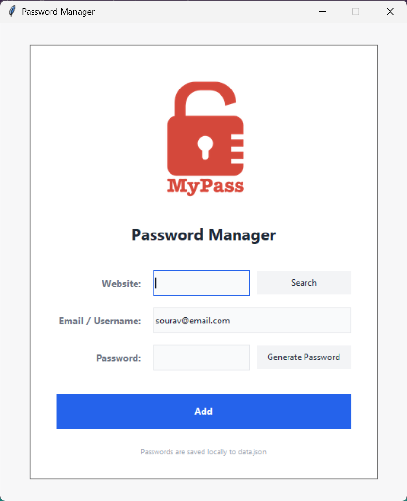

# Password Manager GUI

A simple, lightweight password manager built with **Python** and **Tkinter**.  
Generate strong passwords, save credentials locally, and quickly look them up — all from a clean, minimalist interface.


---

## Features

- **Password Generator** — Creates strong random passwords (letters + numbers + symbols)
- **Save Credentials** — Stores website, email/username, and password in a local `data.json` file
- **Search** — Quickly find saved credentials by website name
- **Clipboard Support** — Generated passwords are automatically copied to the clipboard
- **Minimalist Light UI** — Clean, modern interface with a soft light theme

---

## Screenshots

<div align="center">
  
</div>

> The app features a simple card-based layout with logo, input fields, and action buttons.

---

## Requirements

- Python 3.6+
- `tkinter` (usually included with Python)
- `pyperclip` (for clipboard support)

Install the extra dependency:

```bash
pip install pyperclip
```

---

## Installation & Usage

1. **Clone the repository**

```bash
git clone https://github.com/Souravbanerjeedata/password-manager-gui-with-python-and-tkinter.git
cd password-manager-gui-with-python-and-tkinter
```

2. **Install dependencies**

```bash
pip install pyperclip
```

3. **Run the application**

```bash
python main.py
```

---

## How to Use

1. Enter the **Website** name.
2. Enter your **Email / Username** (a default value is pre-filled).
3. Click **Generate Password** to create a strong password (it is automatically copied to your clipboard).
4. Click **Add** to save the entry.
5. To retrieve a password later, type the website name and click **Search**.

All data is stored locally in `data.json` in the same folder as the script.

---

## Project Structure

```
password-manager-gui-with-python-and-tkinter/
├── main.py          # Main application (GUI + logic)
├── logo.png         # App logo
├── data.json        # Saved passwords (created automatically)
└── README.md        # This file
```

---

## Notes

- Passwords are stored in plain text in `data.json`. This project is intended for learning and personal use. For real-world use, consider adding encryption.
- The footer text and UI colors can be customized easily in the `CONSTANTS` section at the top of `main.py`.

---

## License

This project is open source and available under the [MIT License](LICENSE).
